# PV-RCNN in Waymo Dataset

## Baseline: PV-RCNN from OpenPCDfet
### Data Augmentation
Training 
- [x] filter_by_min_points

        POINTS_NUM: ['TYPE_VEHICLE:5', 'TYPE_PEDESTRIAN:5', 'TYPE_CYCLIST:5']
- [x] filter_by_camera_fov

        FOV: [-115.2, 115.2] 
- [x] random_world_flip
        
         ALONG_AXIS_LIST: ['x','y']
- [x] random_world_rotation

         WORLD_ROT_ANGLE: [-0.78539816, 0.78539816]
- [x] random_world_scaling

         WORLD_SCALE_RANGE: [0.75, 1.25] 

- [ ] gt_sampling

Testing 
- [ ] multi_scale
- [ ] multi and subsequent frame
### Transform points to voxels
    - NAME: transform_points_to_voxels
      VOXEL_SIZE: [0.1, 0.1, 0.1]
      MAX_POINTS_PER_VOXEL: 5
      MAX_NUMBER_OF_VOXELS: {
        'train': 160000,
        'test': 160000
      }
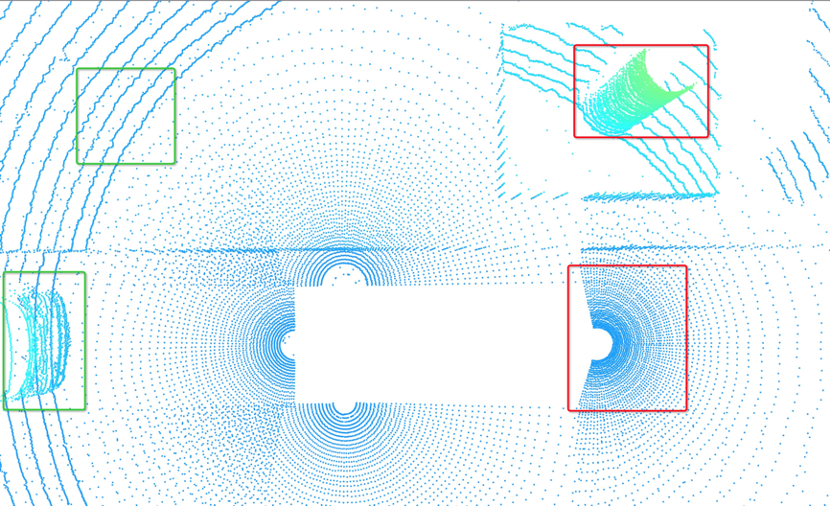
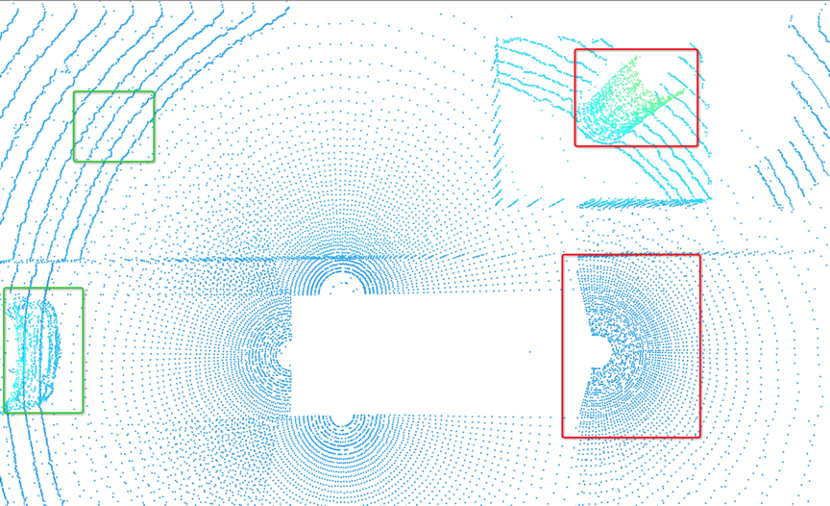

### Set abstraction + further point sampling
Need to sample 10240 points to achieve better coverage of the obeject，there are average 40/8/15 points for Car/Pedestrian/Cyclist.
More efficient sampling strategy to speed-up and enhance performance
- [ ] filtering road-plane
- [ ] feature+coordinate distance measurement 
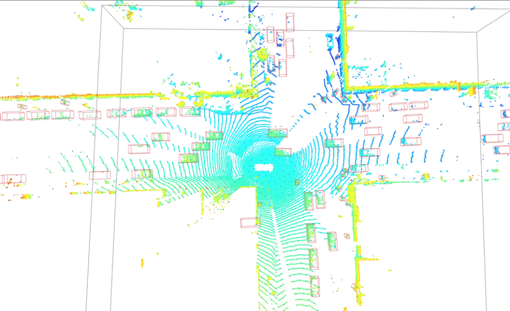
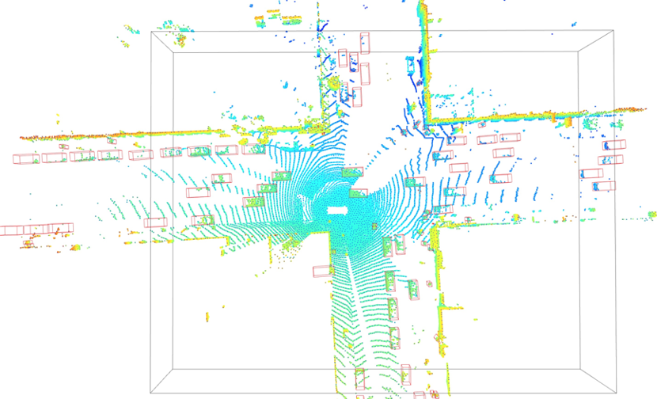

### Time consuming of each module in second

    0:0.0002262592315673828 MeanVFE 
    1:0.11708974838256836 VoxelBackBone8x
    2:0.00029397010803222656 HeightCompression
    3:2.7976667881011963 VoxelSetAbstraction
        3.1:get_sampled_points: 1.087362289428711
        3.2:bev features: 0.0023424625396728516
        3.3:raw features: 1.3562593460083008
        3.4:conv features: 0.25716233253479004
    4:0.004294157028198242 BaseBEVBackbone
    5:0.06638646125793457 AnchorHeadSingle
    6:0.007584810256958008 PointHeadSimple
    7:0.15941095352172852 shared_fc_layer

## Augment using ImVoteNet
### Texture Feature
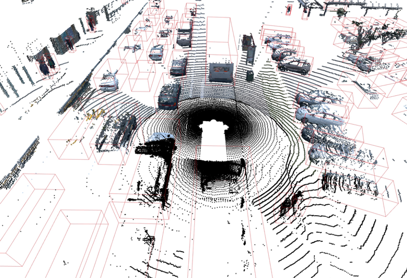

### Semantic Feature
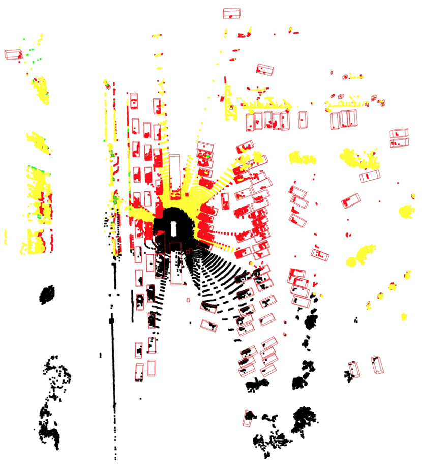

### Geometric Feature
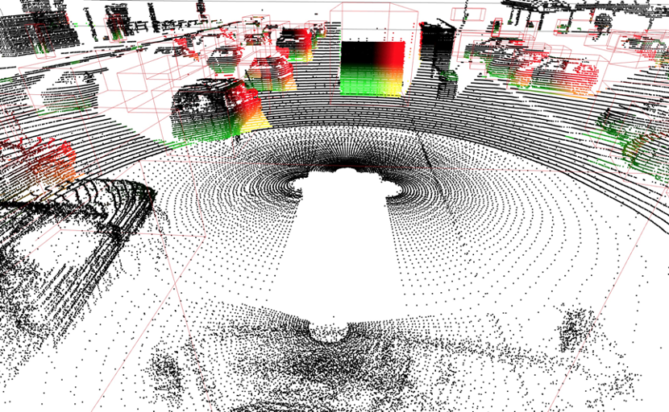

## Augment using Polar+Cartesian CNN
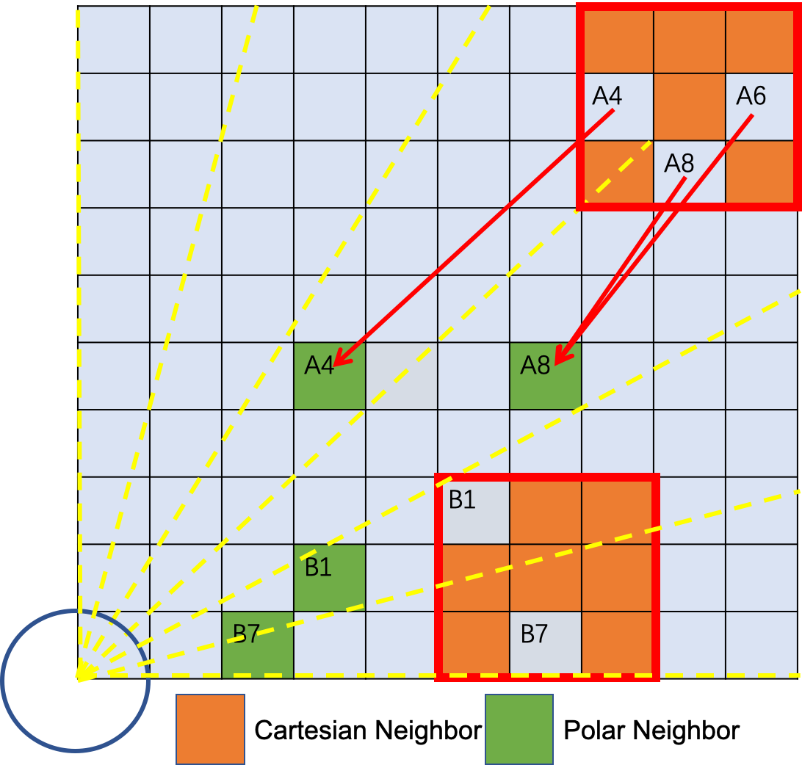
 
## Results

### Visualize
Adding

### Performance
Adding

## Hard case
### Limited points Due to obstruction or long distance
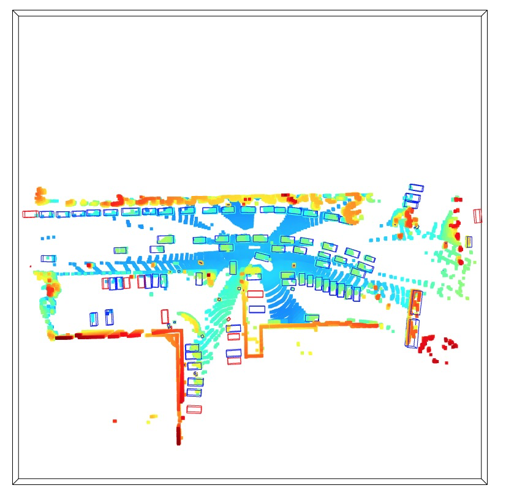
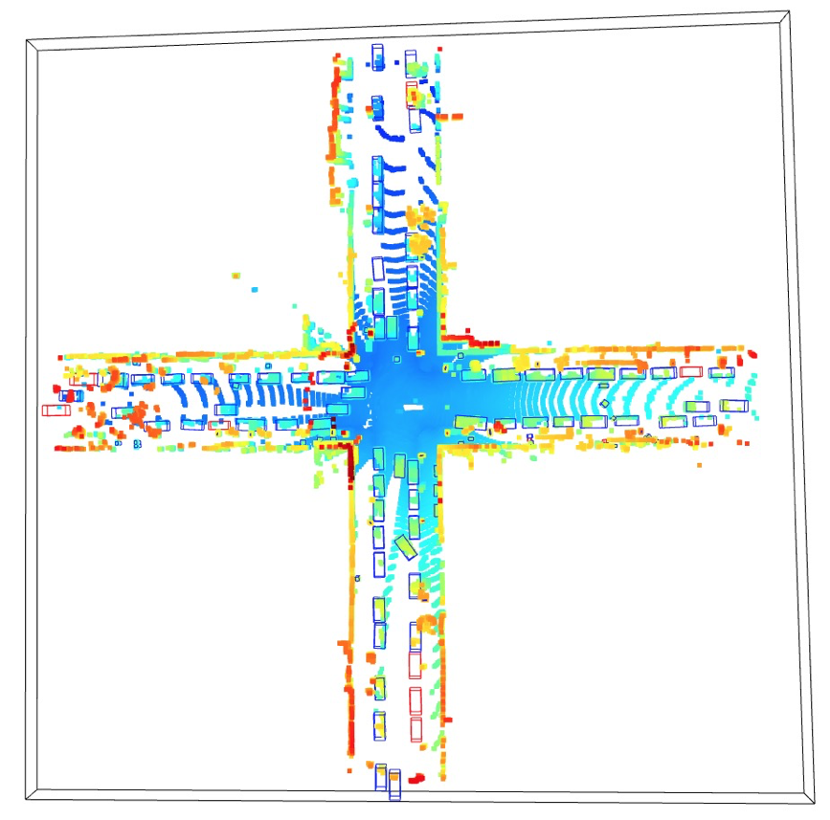

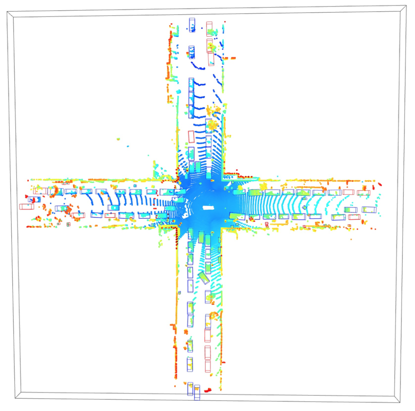

